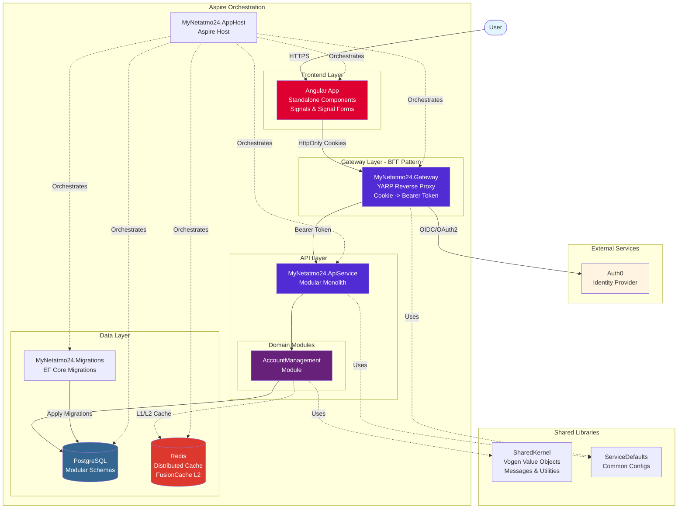
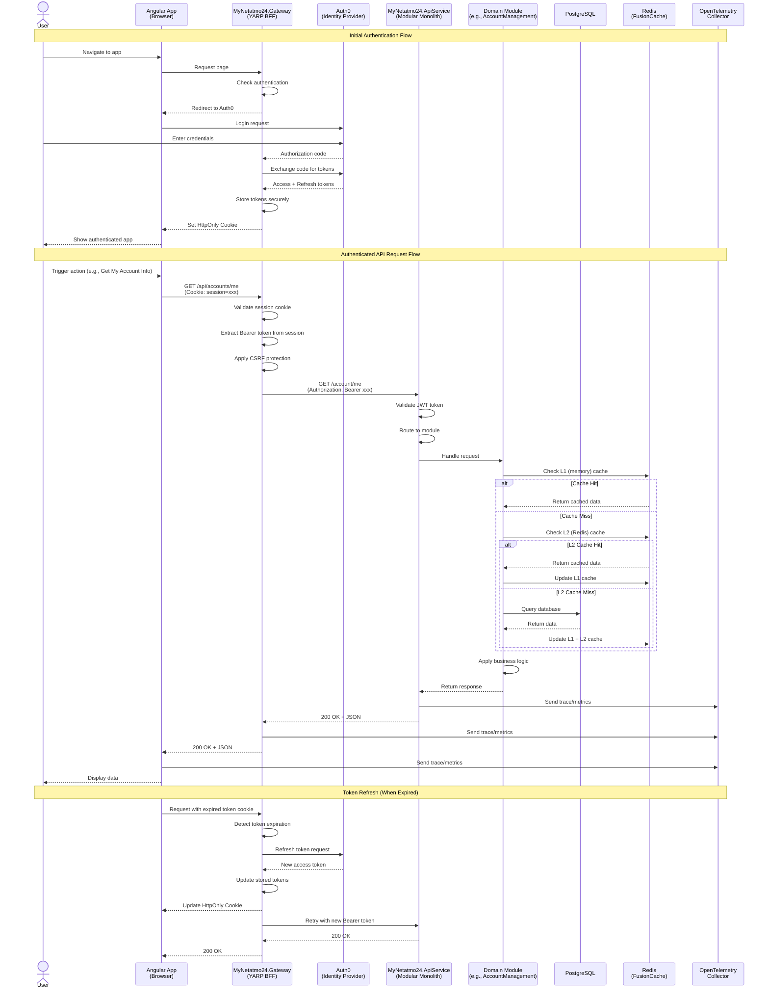
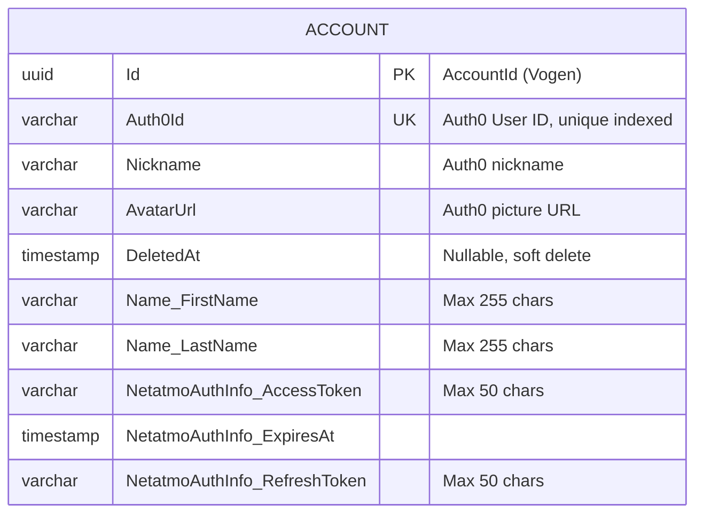

# Critical System Understanding: MyNetatmo24 Application

The MyNetatmo24 application is a monorepo containing a .NET backend and an Angular frontend. It has a comprehensive
testing strategy including unit, integration, architecture, and end-to-end tests.

## Architecture Foundation

**Monorepoi**: All backend and frontend code lives in a single repository, enabling easier cross-team collaboration,
consistent tooling, and simplified dependency management.

**Modular Monolith** + DDD: Clear bounded contexts. Each module implements IModule with separate schemas, DbContexts,
and caching strategies. Always use TUnit for testing.

**BFF Pattern**: Gateway uses YARP to proxy requests, managing authentication server-side. Frontend never touches
tokens-only HttpOnly cookies. The gateway automatically transforms cookies to Bearer tokens for API calls.

**Angular Frontend** Modern Angular 21 app using standalone components, signals, and signal forms. Always use Vitest
for testing.

**Aspire Orchestration**: Aspire hosts the modular monolith, managing service lifecycles, configuration, and
dependencies.

[//]: # (**Observability**: OpenTelemetry collector for metrics, traces, and logs across backend and frontend. Grafana &#40;with )

[//]: # (loki, tempo, blackbox, prometheus&#41; dashboards for visualization.)

### System Architecture

The application follows a modular monolith architecture hosted by .NET Aspire with a BFF (Backend for Frontend)
pattern for secure authentication:

**Key Architectural Decisions**:

- **Aspire Orchestration**: Single command (`dotnet run --project ./MyNetatmo24.AppHost` or `aspire run`) starts the
  entire stack.
- **BFF Pattern**: Gateway handles authentication, transforms cookies to Bearer tokens.
- **Modular Monolith**: Each module has its own DbContext, schema, and bounded context
- **Security-First**: Tokens never exposed to frontend, only secure HttpOnly cookies
- **Observability-Ready**: OpenTelemetry integrated at all layers

### Request Flow

The following diagram illustrates how a typical authenticated API request flows through the system using the BFF
pattern:

**Flow Highlights:**

1. **Authentication**: User logs in via auth0, Gateway stores tokens server-side and issues HttpOnly cookies to
   browser.
2. **Cookie-to-Token Transform**: Gateway automatically converts session cookies to Bearer tokens for API calls.
3. **CSRF Protection**: Gateway validates anti-forgery tokens via YARP transformers.
4. **Hybrid Caching**: FusionCache provides L1 (in-memory) and L2 (Redis) caching with automatic backplane
   synchronization.
5. **Token Refresh**: Gateway handles token refresh transparently without user interaction.
6. **Observability**: Every layer emits traces/metrics to OpenTelemetry collector.
7. **Security**: Frontend never sees tokens, only cookies; reduces XSS attack surface.

### Technologies

- **Backend**: .NET 10, Entity Framework Core, YARP, Vogen, TUnit, ArchUnitNET.
- **Frontend**: Angular 21, TypeScript, DaisyUI with TailwindCSS v4, Angular Testing Library, Vitest, Playwright.

## Core Commands

### Development

- **Start development**: `dotnet run --project ./MyNetatmo24.AppHost` or `aspire run`

### Build

- **Build .NET**: `dotnet build`
- **Build Angular**: `pnpm --filter=frontend-app build`

### Test

- **Run all .NET tests**: `dotnet test`
- **Run Angular tests**: `pnpm --filter=frontend-app test --watch=false --reporter=dot`
- **Run End-to-End tests**: `pnpm --filter=e2e-tests test --reporter=dot`
- **Run all frontend tests**: `pnpm run -r test --watch=false --reporter=dot`

### Lint (and Format)

- **Lint all frontend**: `pnpm run -r lint`
- **Format .NET**: `dotnet format --severity info`

[//]: # (- **Format all**: `pnpm prettier --write .`)

### Database Operations

- **EF migrations**: TODO
- Migrations are applied automatically on startup.

## Major Components

### Backend (.NET)

- **`MyNetatmo24.AppHost`**: Aspire application host for service orchestration.
- **`MyNetatmo24.Gateway`**: YARP-based API gateway with BFF authentication (Auth0).
- **`MyNetatmo24.ApiService`**: Main API service, hosting the different domain modules.
- **`MyNetatmo24.Migrations`**: Database migration service.
- **`MyNetatmo24.ServiceDefaults`**: Shared service configuration.
- **`MyNetatmo24.SharedKernel`**: Domain primitives as value objects (Vogen), shared contracts (messages), common
  utilities.
- **`Directory.Packages.props`**: Centralized package management for all .NET projects.

### Domain Modules

- **`MyNetatmo24.Modules.AccountManagement`**: User's account management.

[//]: # (- MORE TO COME LATER)

### Frontend

- **`MyNetatmo24.Frontend`**: Angular 21 application with standalone components, signals, and signal forms. Uses
  DaisyUI with TailwindCSS v4 for styling.
- **`pnpm-workspace.yaml`**: Use pnpm workspaces with catalogs for package management. For commands, always use
  `pnpm` at the root level with filters when needed.

### Testing Projects

- **`MyNetatmo24.Modules.*.Tests`**: Unit tests for each module (TUnit).
- **`MyNetatmo24.IntegrationTests`**: Service integration tests (TUnit) in combination with test containers.
- **`MyNetatmo24.EndToEndTests`**: Playwright E2E tests with  Auth0 authentication.
- **`MyNetatmo24.Frontend`**: Vitest unit tests for Angular following the syntaxt `*.spec.ts`.
- **`MyNetatmo24.Architectural.Tests`**: Architecture compliance tests (ArchUnitNET).

## Data Stores

- **Primary Database**: PostgreSQL (with option to switch to SQL Server).
- **Distributed Cache**: Redis with FusionCache hybrid L1/L2 caching and backplane for replica.
- **Monitoring** OpenTelemetry collector for metrics, traces, and logs.

### Database Schema

The application uses a modular database schema with separate schemas per module:

**Key Design Patterns:**

- **Strongly-typed IDs**: AccountId and other ids are Vogen value objects wrapping GUIDs.

[//]: # (- **Table-per-Hierarchy &#40;TPH&#41;**: CustomerBillingAddress and CustomerShippingAddress share the
`customeraddresses` table with discriminator column `AddressType`).
- **Complex Properties**: FullName (FirstName + LastName) and NetatmoAuthInfo (AccessToken + RefreshToken +
  ExpiresAt) are configured as owned types.
- **Soft Deletes**: Global query filters automatically exclude entities where DeletedAt is not null.
- **Shadow Properties**: Foreign keys are configured as shadow properties (not exposed in entity classes).
- **Modular Schemas**: Each module has its own database schema (accountmanagement, ...) for clear bounded contexts.

## Security

### User Authentication

- **Identity Provider**: Auth0
- **BFF Pattern**: with YARP
- **Cookies**: for session management, no tokens in frontend storage
- **Token Management**: Automatic token refresh in BFF layer, not exposed to frontend but used in API projects

### Security Features

- **OWASP Top 10**: Always consider during development ( Broken Access Control, Insecure Design, Mishandling of
  Exceptional Conditions, etc.).
- **CSRF Protection**: Custom antiforgery tokens via YARP transformers
- **Cookie Security**: Only secure, HttpOnly cookies for session tokens

### Secret Management

Use SOPS for encrypting sensitive configuration files.
When a change is made to the appsettings, always update the encrypted version as well.

- **Encrypted Config**: `config/appsettings.encrypted.json`
- **Decrypt**: `sops --decrypt "config/appsettings.encrypted.json" > "MyNetatmo24.AppHost/appsettings.json"`
- **Encrypt**: `sops --encrypt "MyNetatmo24.AppHost/appsettings.json" > "config/appsettings.encrypted.json"`
- **Pattern**: Only fields matching `Secret|Password|Key|Token` are encrypted
